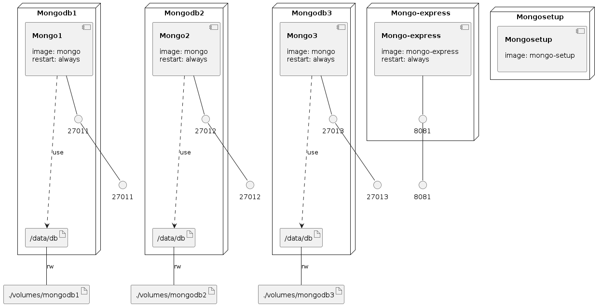

# docker-mongodb-replica-set
Auto setup mongodb replica set by docker compose

Add the following config to `/etc/hosts`
```
127.0.0.1	mongodb1
127.0.0.1	mongodb2
127.0.0.1	mongodb3
```

Run docker compose
```bash
$ docker-compose up
```

Access http://localhost:8081/ to open Mongo Express

Connect to mongodb by URL: `mongodb://mongodb1:27011,mongodb2:27012,mongodb3:27013/?replicaSet=rs0`

### Infrastructure model

